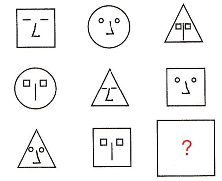

# ЛогПро МАИ: Экзамен

## Кошка

Вам необходимо придумать способ представления в Прологе геометрических фигур, показанных на рис. Вашего варианта, сгенерировать новую фигуру,  реализовать предикат, который генерирует все возможные варианты фигур, кодирует фигуру в число и декодирует из числа в фигуру.

Вам необходимо представить, сгенерить, кодировать/декодировать -  Маску 

Для решения задачи были выполнены следующие шаги:

- [x] Придумайте способ представления фигуры
- [x] Опишите предикат генерации новой фигуры, не представленной на рисунке
- [x] Опишите предикат кодирования фигуры в число и декодирования из числа в фигуру (в способе представления из п. 1)

Решение находится в файле [`solution.pl`](/solution.pl).
